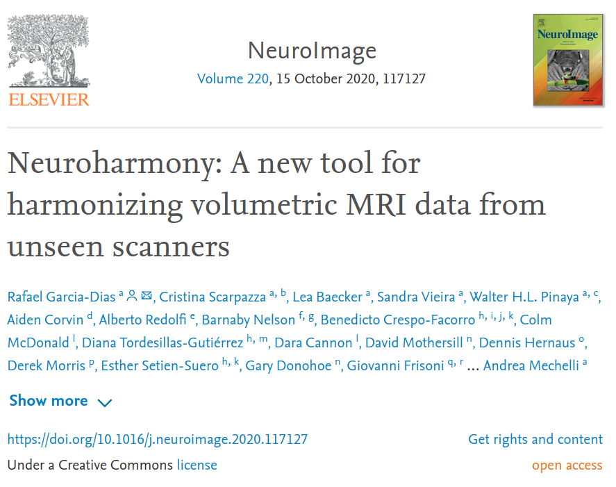

============================
Neuroharmony's documentation
============================

.. raw:: html

  

    The increasing availability of magnetic resonance imaging (MRI) datasets is boosting the interest in the application
    of machine learning in neuroimaging. A key challenge to the development of reliable machine learning models, and
    their translational implementation in real-word clinical practice, is the integration of datasets collected using
    different scanners. Current approaches for harmonizing multi-scanner data, such as the ComBat method, require a
    statistical representative sample, and therefore are not suitable for machine learning models aimed at clinical
    translation where the focus is on the assessment of individual scans from previously unseen scanners. To overcome
    this challenge, Neuroharmony uses image quality metrics (i.e. intrinsic characteristics which can be extracted
    from individual images without requiring a statistical representative sample and any extra information about the
    scanners) to harmonize single images from unseen/unknown scanners based on.
  

.. toctree::
   :maxdepth: 2
   :hidden:
   :caption: Neuroharmony

   neuroharmony

.. toctree::
   :maxdepth: 2
   :hidden:
   :caption: Documentation

   api
